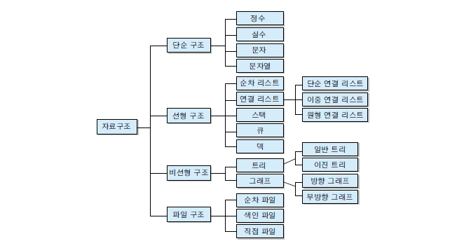
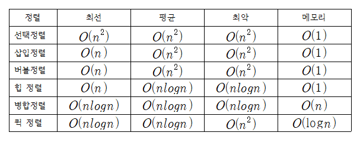

# DataStructure

## Data Structure

## 자료구조의 분류

* 선형구조

  : 데이터를 저장할 때 연속적인 기억 공간에 배정하는 자료구조\(배열, 스택, 큐, 데크, 연결리스트\)

* 비선형 구조 

  : 기억 공간 내의 위치와 별개로 독립하여 저장하는 구조 \(트리, 그래프\)

## 시간 복잡도

* 연산 시간의 크기 순서 

  O\(1\) &lt; O\(logn\) &lt; O\(n\) &lt; O\(nlogn\) &lt; O\(n^2\) &lt; O\(n^3\) &lt; O\(2^n\) &lt; O\(n!\)   

* O\(1\)이 가장 빠르며 해쉬 검색 알고리즘에서 사용된다.

[Reference : naver d2](https://d2.naver.com/helloworld/0315536)

