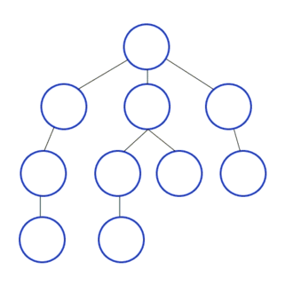

# DepthFirstSearch

## Depth First Search

## 깊이 우선 탐색\(Depth-First Search\)

: 루트 노드\(혹은 다른 임의의 노드\)에서 시작해서 다음 분기\(branch\)로 넘어가기 전에 해당 분기를 완벽하게 탐색하는 방법

## 깊이 우선 탐색\(DFS\)의 특징

* 자기 자신을 호출하는 순환 알고리즘의 형태 를 가지고 있다.
* 전위 순회\(Pre-Order Traversals\)를 포함한 다른 형태의 트리 순회는 모두 DFS의 한 종류이다.
* 이 알고리즘을 구현할 때 가장 큰 차이점은, 그래프 탐색의 경우 어떤 노드를 방문했었는지 여부를 반드시 검사 해야 한다는 것이다.
* 이를 검사하지 않을 경우 무한루프에 빠질 위험이 있다.



```java
public class DFSGraph {
    private int V; // 노드의 개수
    private LinkedList<Integer> adj[]; // 인접 리스트

    /* 생성자 */
    public DFSGraph(int v) {
        V = v;
        adj = new LinkedList[v];
        for (int i = 0; i < v; ++i) // 인접 리스트 초기화
            adj[i] = new LinkedList();
    }

    /* 노드를 연결 */
    void addEdge(int v, int w) {
        adj[v].add(w);
    }

    /* DFS에 의해 사용되는 함수 */
    void DFSUtil(int v, boolean visited[]) {
        // 현재 노드를 방문한 거승로 표시하고 값을 출력 
        visited[v] = true;
        System.out.print(v + " ");

        // 방문한 노드와인접한 모든 노드를 가져온다 
        Iterator<Integer> i = adj[v].listIterator();
        while (i.hasNext()) {
            int n = i.next();
            // 방문하지 않는 노드면 해당 노드를 시작 노드로 다시 DFSUtil 호출
            if (!visited[n]) 
                DFSUtil(n, visited);// 순환 호출
        }
    }

    void DFS(int v) {
        // 노드의 방문 여부 판단 
        boolean visited[] = new boolean[V];

        // 비연결형 그래프의 경우, 모든 정점을 하나씩 방문
        for (int i = 0; i < V ; ++i) {
            if (visited[i] == false)
                DFSUtil(i, visited);
        }
    }
    public static void main(String args[]) {
        DFSGraph g = new DFSGraph(4);

        g.addEdge(0, 1);
        g.addEdge(0, 2);
        g.addEdge(1, 2);
        g.addEdge(2, 0);
        g.addEdge(2, 3);
        g.addEdge(3, 3);

        System.out.println("vertax 2에서 시작하는 DFS(깊이 우선 탐색)");
        g.DFS(2); /* 주어진 노드를 시작 노드로 DFS 탐색 */
        // 0 1 2 3

        // g.DFS(); /* 비연결형 그래프의 경우 */
    }
}
```

