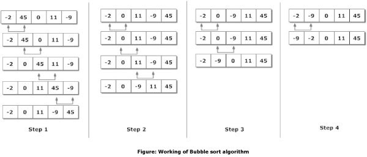

# bubbleSort

## Bubble Sort

: 인접한 두 숫자끼리 비교 해서 더 작은 숫자를 앞으로 보내주는 것을 반복

* 인접한 것을 비교해서 가장 큰 값이 맨 뒤로 이동하게 된다 
* 제일 큰 값이 뒤로 가게 되면 맨 뒤의 값을 제외하면서 비교를 하면서 제일 큰 값을 뒤로 보낸다 
* 정렬 알고리즘 중에서 구현은 가장 쉽지만 가장 비효율적인 알고리즘
* 버블 정렬의 시간 복잡도는 O\(N^2\) 이다 

## 정렬 방법



```java
public class BubbleSort {
    public static void main(String[] args) {
        int i, j, temp;
        int[] arr = { 1, 10, 5, 8, 7, 6, 4, 3, 2, 9 };
        for (i = 0 ; i < arr.length; i++) {
            for (j = 0; j < arr.length-1 - i; j++) {
                if (arr[j] > arr[j + 1]) {
                    temp = arr[j];
                    arr[j] = arr[j + 1];
                    arr[j + 1] = temp;
                }
            }
        }
        for ( i = 0; i < arr.length ; i++) {
            System.out.printf("%d ", arr[i]);
        }
    }
}
```

