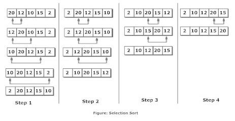

### selectionSort

### 선택 정렬 (SelectSort)
: 가장 작은 것을 선택해서 계속해서 제일 앞으로 보내는 알고리즘 
- 가장 원시적이고 기초적인 방법 중 하나 
- 데이터의 갯수가 N개일 때 총 몇번의 비교 연산을 해야 되는지 알아야 한다.
- 선택 정렬은 대략 N * (N+1)/2 번 가량의 연산을 수행해야 한다. 
- 이를 컴퓨터에서는 가장 큰 차수인 N^2만 보고 O(N^2)이라고 표현한다. 즉, 선택 정렬의 시간 복잡도는 O(N^2)이다 

### 정렬 방법
 <br>
- 위에 보는 그림과 같이 step 에서는 순서대로 비교하며 index 0의 값을 끝에 값까지 비교한다
- 각각의 step을 거치면서 수행하면서 최솟값을 찾아서 위치를 바꿔준다 
- N개의 원소에 대해서는 N-1번을 비교하기 비교한다 

```java
public class SelectionSort {
	public static void main(String[] args) {
		int i, j, temp;
		int[] arr = {1, 10, 5, 8, 7, 6, 4, 3, 2, 9};
		
		for(i = 0; i < arr.length-1; i++) {
			for (j = i+1; j < arr.length ; j++) {
				if (arr[i] > arr[j]) {
					temp = arr[i]; // 가장 앞에 있는 값으로 위치
					arr[i] = arr[j]; // 가장 앞에 있는 값을 최소값을 위치
					arr[j] = temp;
				}
			}
			// swap (가장 앞에 있는 값과 최소값을 변경)
		}
		for (i =0  ; i < arr.length; i++) {
			System.out.printf("%d ", arr[i]);
		}
	}
}
```
