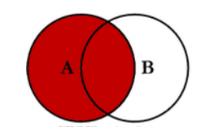
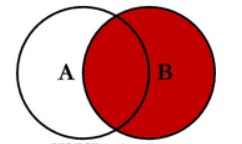

# join

## Join

=&gt; 서로 관련된 테이블의 데이터를 연결하여 추출하는 방법


* 다음과 같이 inner join, outer join을 비교

## join 실습

* 다음과 같이 A와 B가 각각 \(1, 2, 3, 4\), \(3, 4, 5, 6\) 의 값을 가지고 있으며,
* a와 b는 \(3, 4\)의 공통된 데이터를 가지고 있다 

```text
A    B
-    -
1    3
2    4
3    5
4    6
```

### inner join

: inner join은 공통된 데이터를 출력하게 된다   


```text
select * from a INNER JOIN b on a.a = b.b;
select a.*, b.*  from a,b where a.a = b.b;

a | b
--+--
3 | 3
4 | 4
```

### left outer join



```text
select * from a LEFT OUTER JOIN b on a.a = b.b;
select a.*,b.* from a,b where a.a = b.b(+);

a | b 
--+--
1 | null 
2 | null 
3 | 3 
4 | 4
```

### right outer join



```text
select * from a RIGHT OUTER JOIN b on a.a = b.b; 
select a.*,b.* from a,b where a.a(+) = b.b;

a | b 
--+--
3 | 3 
4 | 4 
null | 5 
null | 6
```

### full outer join


```text
select * from a FULL OUTER JOIN b on a.a = b.b;

a | b
---+---
1 | null 
2 | null 
3 | 3 
4 | 4 
null | 5 
null | 6
```

