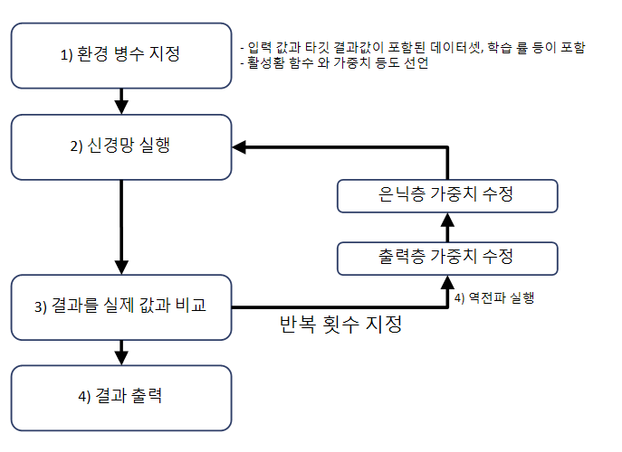
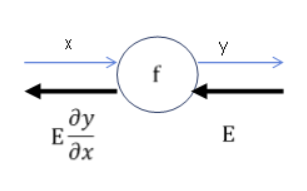
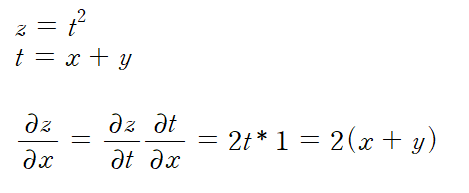
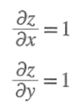
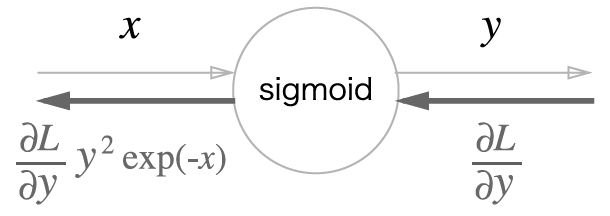
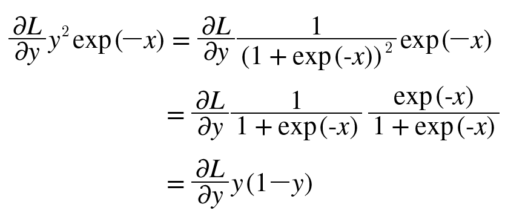
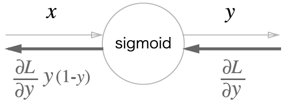
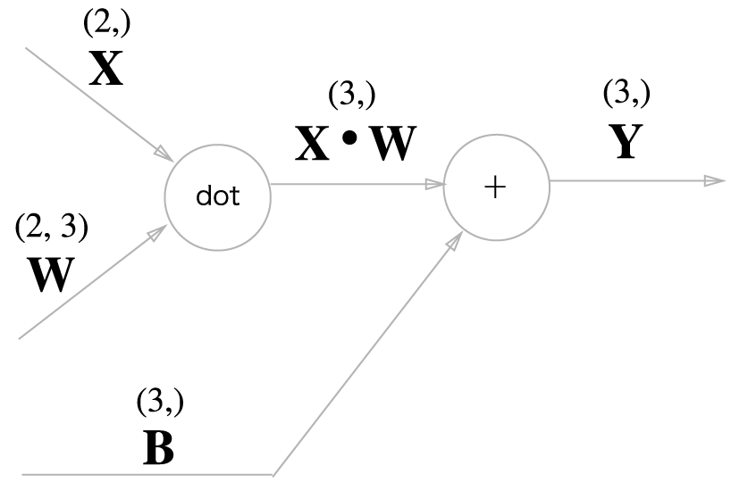
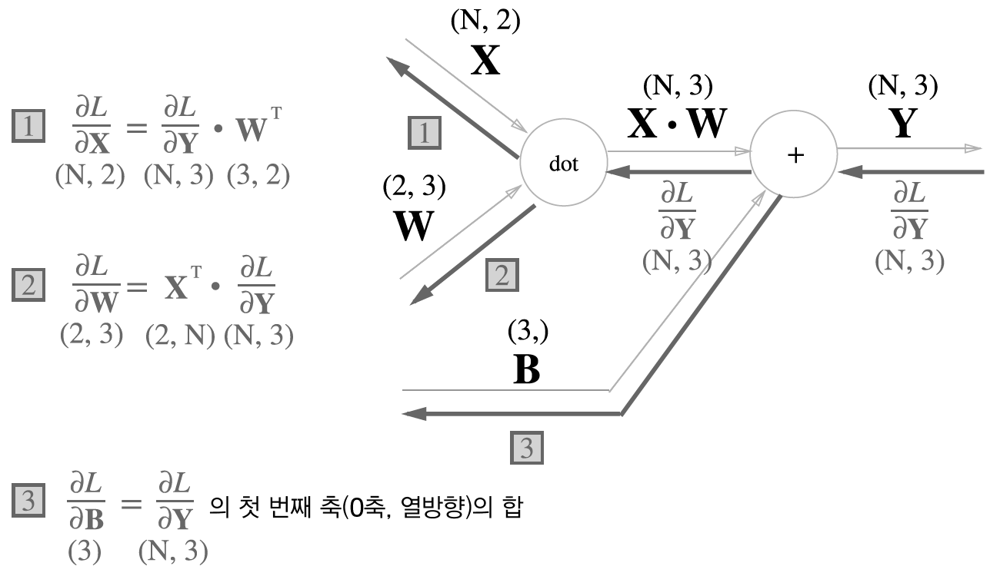

# backPropagation

## back propagation

## 오차 역전파\(back propagation\)

: 가중치 매개변수의 기울기를 효율적으로 계산 가중치에서 기울기를 빼도 값의 변화가 없을 때까지 계속해서 가중치 수정 작업을 반복하는 것

오차 역전파 구동 방식 1. 임의의 초기 가중치\(W\)를 준 뒤 결과\(Y\)를 계산한다 2. 계산 결과와 우리가 원하는 값 사이의 오차를 구한다 3. 경사 하강법을 이용해 바로 앞 가중치를 오차가 작아지는 방향으로 업데이트 4. 위 과정을 더이상 오차가 줄어들지 않을 때까지 반복

* 오차가 작아지는 방향으로 업데이트한다는 의미는 미분 값이 0에 가까워지는 방향으로 나아간다는 의미 
* 그래서 오차역전파를 다른 방식으로 표현하면 가중치에서 기울기를 빼도 값이 변화가 없을 떄까지 계속해서 가중치 수정 작업을 반복하는 것 


신경망의 구현 과정  
    


다층 퍼셉트론이 오차 역전파를 만나 신경망이 되고, 신경망은 xor 문제를 가볍게 해결하지만, 문제점이 생긴다 기울기 소실 \(vanishing gradient\) : 층이 늘어나면서 역전파를 통해 전달되는 이 기울기의 값이 점점 작아져 맨 처음층까지 전달되지 않는 문제 이는 활성화 함수로 사용된 시그모이드 함수의 특성 때문이다

## 계산 그래프 \(computational graph\)

: 계산과정을 그래프로 표현하며, 우리가 잘아는 그래프 자료구조로 복수의 노드\(node\)와 에지\(edge\)로 표현

ex\) 슈퍼에서 사과를 2개 귤을 3개 샀습니다. 사과 1개에 100원 귤을 150원 이고, 소비세가 10% 일때 지불 금액을 구하시오  
    


Tip\) 계산을 왼쪽에서 오른족으로 진행하는 단계를 순전파 \(forward propagation\)라고 마혀, 순전파는 계산 그래프의 출발점부터 종착점으로의 전파이다 그것의 반대로 반향으로 진행하는 전파를 역전파\(backward propagation\)라고 하며, 미분을 계산할 때 중요한 역할을 한다

* 국소적 계산

  계산 그래프의 특징은 국소적 계산을 전파함으로써 최종 결과를 얻는다는 점에 있다. 국소적이란 자신과 직접 관계된 작은 범위라는 뜻이고, 국소적 계산은 결국 전체에서 어떤 일이 벌어지는 상관없이 자신과 관계된 정보만으로 결과를 출력할 수 있다는 점이다. 즉, 복잡한 계산도 분해하면 단순한 계산으로 구성한다는 점이다.

왜? 계산 그래프인가? : 계산 그래프를 통해서 순전파와 역전파를 활용해서 각 변수의 미분을 효율적으로 구할수 있다는 장점이 있다

## 연쇄법칙

: 연전파는 국소적인 미분을 순방향과는 반대인 오른쪽에서 왼쪽으로 전달한다. 이 국소적 미분을 전달하는 원리를 연쇄법칙\(chain rule\)에 따른 것이다



* 다음과 같이 역전파의 계산 절파는 신호 E에 노드의 국소적 미분을 곱한후 다음노드로 전달하는 것이다. 여기서 말하는 국소적 미분은 순전파 때의 y=f\(x\) 계산의 미분을 구하는것이며, 이는 x에 대한 y의 미분을 구한다는 뜻이다. 이것이 역전파의 계산 순서인데, 이러한 방식을 따르면 목표로 하는 미분 값을 효율적으로 구할 수 있다는 것이 이 전파의 핵심이다.
* 연쇄법칙은 합성함수의 미분에 대한 성질이며, 합성함수의 미분은 함성함수를 구성하는 각 함수의 미분의 곱으로 나타낼수 있다.



* 다음과 같이 z와 t에 대해서, x에 대한 편미분을 통한 값을 합성함수를 이용할 수 있다는 것을 보여주고 있다.

연쇄법칙을 계산 그래프로 나타내면  
    
 : 순전파와는 반대 방향으로 국소적 미분을 곱하여 전달한다

   
 : 계산 그래프의 연전파 결과에 따르면 z를 x에 대한 편미분 값은 2\(x+y\)가 된다

## 덧셈 노드의 역전파

* z = x + y라는 식을 대상으로 역전파를 살펴보면, 다음과 같이 미분을 해석적으로 계산할 수 있다



* 다음과 같이 모두 1이 되며 그래프로 그리면 


* 상류에서 전해진 미분에 1을 곱하여 하류로 흘려보내며, 덧셈 노드의 역전파는 1을 곱하기만 할 뿐이므로 입력된 값을 그대로 다음 노드로 보내게 된다
* 구체적인 예를 하나 살펴보면, 가령 10 + 5 = 15 라는 계산이 있고, 상류에서 1.3이라는 값이 흘러들오는 것을 계산 그래프로 표현하면   
* 즉 덧셈 노드 역전파는 입력 신호를 다음 노드로 출력 뿐이므로 1.3을 그래도 다음 노드로 전달한다 

## 곱셈 노드의 역전파

* z = xy라는 식을 대상으로 역전파를 살펴보면, 다음과 같이 미분을 해석적으로 계산할 수 있다


* 다음과 같이 편미분을 하면 각각의 조건에 따라 결과가 나온다 


* 곱셈 노드 역전파는 상류이 값에 순전파 때의 입력 신호들을 서로 바꾼 값을 곱해서 하류로 보낸다. 
* 서로 바꾼 값이란 순전파 때 x였다면 역전파에서는 y, 순전파 때 y였다면 역전파에서는 x로 바꾼다는 의미이다
* 구체적인 예를 보면, 10 x 5 = 50이라는 계산이 있고, 역전파 때 상류에서 1.3값이 흘러온다면 계산그패프로 표현하면   
* 입력 신호를 바꾼 값을 곱하여 하나는 1.3 x 5 = 6.5, 다른 하나는 1.3 x 10 = 13 이 된다. 
* 곱셈의 역전파는 순방향 입력 신호의 값이 필요하며, 곱셈 노드를 구현할 때는 순전파의 입력 신호를 변수에 저장해 둔다 

## 단순한 계층 구현하기 : 곱셈 계층

```python
class MulLayer:
    def __init__(self):
        self.x = None
        self.y = None

    def forward(self, x, y):
        self.x = x
        self.y = y
        out = x * y

        return out

    def backward(self, dout):
        dx = dout * self.y
        dy = dout * self.x

        return dx, dy

apple = 100
apple_num = 2
tax = 1.1

# 계층들 
mul_apple_layer = MulLayer()
mul_tax_layer = MulLayer()

# 순전파 
apple_price = mul_apple_layer.forward(apple, apple_num)
price = mul_tax_layer.forward(apple_price, tax)
print(price) # 220

# 역전파
dprice = 1
dapple_price, dtax = mul_tax_layer.backward(dprice)
dapple, dapple_num = mul_apple_layer.backward(dapple_price)
print(dapple, dapple_num, dtax) # 2.2 110 200
```

* init\(\)는 인스턴스 x와 y를 초기화 하며, 이 두변수는 순전파 시의 입력값을 유지하기 위해서 사용
* forward\(\)에서는 x와 y를 인수로 받고 두 값을 곱해서 반환
* backward\(\)에서는 상류에서 넘어온 미분\(dout\)에 순전파 때의 값을 서로 바꿔 곱한 후 하류로 흘린다 
* backward\(\)가 받는 인수는 순전파의 출력에 대한 미분임에 주의

## 단순한 계층 구현하기 : 덧셈 계층

```python
class AddLayer:
    def __init__(self):
        pass

    def forward(self, x, y):
        out = x + y
        return out

    def backward(self, dout):
        dx = dout * 1
        dy = dout * 1
        return dx, dy

class MulLayer:
    def __init__(self):
        self.x = None
        self.y = None

    def forward(self, x, y):
        self.x = x
        self.y = y
        out = x * y

        return out

    def backward(self, dout):
        dx = dout * self.y
        dy = dout * self.x

        return dx, dy

apple = 100
apple_num = 2
orange = 150
orange_num = 3
tax = 1.1


# 계층들 
mul_apple_layer = MulLayer()
mul_orange_layer = MulLayer()
add_apple_orange_layer = AddLayer()
mul_tax_layer = MulLayer()

# 순전파 
apple_price = mul_apple_layer.forward(apple, apple_num)
orange_price = mul_orange_layer.forward(orange, orange_num)
all_price = add_apple_orange_layer.forward(apple_price, orange_price)
price = mul_tax_layer.forward(all_price, tax)


# 역전파
dprice = 1
dall_price, dtax = mul_tax_layer.backward(dprice)
dapple_price, dorange_price = add_apple_orange_layer.backward(dall_price)
dapple, dapple_num = mul_apple_layer.backward(dapple_price)
dorange, dorange_num = mul_orange_layer.backward(dorange_price)
print(price) # 715
print(dapple, dapple_num, dorange, dorange_num, dtax) # 2.2 110 3.3 165 650
```

* addLayer의 덧셈계층에서는 초기화가 필요없으니 init에서는 아무 일도 일어 나지 않는다 
* 필요한 계층을 만들어 순전파 메서드인 forward\(\)를 적절한 순서로 호출한다 
* 그런 다음 순전파와 반대 순서로 역전파 메서드인 backward\(\)를 호출하면 원하는 미분이 나온다 

## 활성화 함수 게층 구현하기 : ReLU계층


* 다음과 같이 순전파일 때의 입력 x가 0보다 크면 역전파는 상류의 값을 그대로 하류로 흘린다.
* 반면, 순전파 때 x가 0이하면 역전파 때는 하류로 신호를 보내지 않는다\(0을 보낸다\)

```python
import numpy as np

class ReLu:
    def __intt__(self):
        self.mask = None 
# ReLu는 mask라는 인스턴스 변수를 가지며, True/False로 구성된 넘파이 배열로, 
# 순전파의 입력인 x의 원소값이 이하인 인덱스는 true, 그외(0보다 큰 원소)는 False로 유지한다 

    def forward(self, x):
        self.mask = (x <= 0)
        out = x.copy()
        out[self.mask] = 0
        return out

    def backward(self, dout):
        dout[self.mask] = 0
        dx = dout
        return dx

x = np.array([[1.0, -0.5], [-0.2, 3.0]])
print(x) # [[ 1.  -0.5]  [-0.2  3. ]]
mask = (x <= 0)
print(mask) # [[False  True]  [ True False]]
```

* 다음과 같이 순전파 때의 입력값이 0이하면 역전파 때의 값은 0이 돼야 한다. 그래서 역전파 때는 순전파 때 만들어둔 mask를 써서 mask의 원소가 True인 곳에는 상류에서 전파된 dout을 0으로 설정한다 

## 활성화 함수 게층 구현하기 : Sigmoid 계층


* sigmoid 계층의 계산 그래프 \(순전파\)

     

* 위에서는 x와 + 노드 말고도 exp 와 / 노드가 새롭게 등장했으며, exp노드는 y = exp\(x\)계산을 수행하고 / 노드는  y = 1/x 계산을 수행

1단계  
    


* '/' 노드, 즉 y = 1/x를 미분하면 다음의 식이 된다
* 역전파 때는 상류에서 흘러운 값에 -y\*\*2\(순전파의 출력을 제곱한 후 마이너스를 붙인 값\)을 곱해서 하류로 전달 

     

2단계  


* '+' 노드는 상류의 값을 여과없이 하류로 내보내는 역할

     

3단계  


* exp 노드는 y = exp\(x\) 연산을 수행하며, 상류의 값에 순전파 때의 출력을 곱해 하류로 전파 

     

4단계  


* 'x'노드는 순전파 때의 값을 서로 바꿔 곱한다. 

     

간소화 번전  
    


* 간소화 버전은 역전파 과정의 중간 계산들을 생략할 수 있어 효율적인 계산이라 말할 수 있으며, 
* 노드를 그룹화하여 sigmoid 계층의 세세한 내용을 노출하지 않고 입력과 출력에만 집중할 수 있다 

위의 결과값을 정리하면  
    


* 이처럼 sigmoid 계층의 역전파는 순전파의 출력\(y\)만으로 계산할 수 있다 

     

```python
class Sigmoid:
    def __init__(self):
        self.out = None

    def forward(self, x):
        out = 1 / (1 + exp(-x))
        self.out = out
        return out

    def backward(self, dout):
        dx = dout * (1.0 - self.out) * self.out
        return dx
```

* 이 구현에서는 순전파의 출력을 인스턴스 변수 out에 보관했다가, 역전파 계산 때 그 값을 사용한다 

## Affine/Softmax 계층 구현하기 : Affine 계층

: 신경망의 순전파 때 수행하는 행렬의 곱은 기하학에서는 어파인 변환\(Affine transformation\)이라고 하며,   
 어파인 변환을 수행하는 처리를 Affine 계층이라는 이름으로 구현한다



* X, W, B 가 행렬\(다차원 배열\)로 순전파의 계산 그래프 


* 여기서 Wt와 Xt는 전치 행렬로 \(i, j\) 위치인 원소를 \(j, i\)위치로 바꾼 것을 말한다 
* \(i, j\)에서 i는 세로의 크기, j는 가로의 크기로 생각한다
* 행렬 곱\(dot 노드\)의 역전파는 행렬의 대응하는 차워느이 원소 수가 일치하도록 곱을 조립하여 구할 수 있다   

배치용 Affine 계층   
 : 데이터 N개를 묶어 순전파하는 경우, 즉 배치용 affine 계층을 구현 \(묶은 데이터를 배치라고 한다\)



* 기존과 다른 부분은 입력 x의 형상이 \(N, 2\)가 된것이다
* 편향을 더할 때도 주의해야 한다. 순전파 때의 편향 덧셈은 X, W에 대한 편향이 각 데이터에 더해진다 

ex\) N = 2\(데이터가 2개\)로 한경우, 편향은 두 데이터 각각에 \(각각의 계산 결과에\) 더해진다

```python
import numpy as np

x_dot_w = np.array([[0, 0, 0], [10, 10, 10]])
B = np.array([1, 2, 3])

print(x_dot_w) # [[ 0  0  0] [10 10 10]]
print(x_dot_w + B) # [[ 1  2  3]  [11 12 13]]

# 역전파
dy = np.array([[1, 2, 3], [4, 5, 6]])
dB = np.sum(dy, axis=0)

print(dy) # [[1 2 3] [4 5 6]]
print(dB) # [5 7 9]
```

* 역전파 때는 각 데이터의 역전파 값이 편향의 원소에 모여야 한다 
* 편향의 역전파는 그 두데이터에 대한 미분을 데이터마다 더해서 구하며, np.sum\(\)에서 0번째 축\(데이터를 단위로 한축\)에 대해서 \(axis=0\)의 총합을 구하는 것이다 

```python
class affine:
    def __init__(self, W, b):
        self.W = W
        self.b = b
        self.x = None
        self.dW = None
        self.db = None

    def forward(self, x):
        self.x = x
        out = np.dot(x, self.W) + self.b
        return out

    def backward(self, dout):
        dx = np.dot(dout, self.W.T)
        self.dW = np.dot(self.x.T, dout)
        self.db = np.sum(dout, axis=0)
        return dx
```

