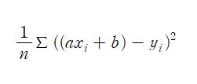
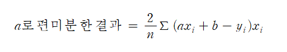
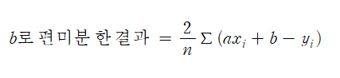
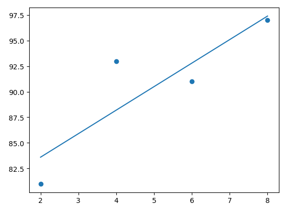
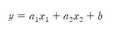
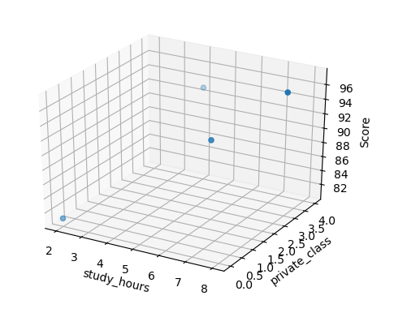

# Gradient Descent

## 경사 하강법 \(Gradient Descent\)

: 미분 기울기를 이용하는 경사하강법은 오차를 비교하여 가장 작은 방향으로 이동시키는 방법

즉, '미분 값이 0인 지점'을 찾는 것이다 1. a1에서 미분을 구한다 2. 구해진 기울기의 반대 방향\(기울기가 +면 음의 방향, -면 양의 방향\)으로 얼마간 이동시킨 a2에서 비분을 구한다 3. 구한 미분 값이 0이 아니면 위 과정을 반복

## 학습률 \(learning rate\)

: 어느 만큰 이동시킬지를 신중히 결정해야 하는데, 이때 이동거리를 정해 주는 것이 바로 학습률이다 다시 말해, 경사하강법은 오차 변화에 따라 이차 함수 그래프를 만들고 적절한 학습률을 설절해 미분 값이 0인 지점을 구하는 것이다

## 경사하강법 코딩

최솟값을 구하기 위해서는 이차 함수에서 미분해야 하고, 그 이차 함수는 평균 제곱 오차를 통해서 나온 것이다

평균 제곱 오차를의 식은   
    
   


이 값을 미분할 때 우리가 궁금한 것은 a와 b라는 것에 주의해야 하며, 필요한 값을 중심으로 미분해야 하기 때문에 특정한 값을 미분하는 편미분을 사용한다.   
   
   


위 결과로 코딩을 하면

```python
import numpy as np
import pandas as pd
import matplotlib.pyplot as plt

#공부시간 X와 성적 Y의 리스트를 만듭니다.
data = [[2, 81], [4, 93], [6, 91], [8, 97]]
x = [i[0] for i in data]
y = [i[1] for i in data]

#그래프로 나타내 봅니다.
plt.figure(figsize=(8,5))
plt.scatter(x, y)
plt.show()

# 리스트로 되어 있는 x와 y값을 넘파이 배열로 바꾸어 줍니다.
# (인덱스를 주어 하나씩 불러와 계산이 가능해 지도록 하기 위함입니다.)
x_data = np.array(x)
y_data = np.array(y)

# 기울기 a와 절편 b의 값을 초기화 합니다.
a = 0
b = 0

#학습률을 정합니다.
lr = 0.03 

#몇 번 반복될지를 설정합니다.
epochs = 2001 

#경사 하강법을 시작합니다.
for i in range(epochs):                               # epoch 수 만큼 반복
    y_hat = a * x_data + b                            # y를 구하는 식을 세웁니다 (Hy)
    error = y_data - y_hat                            # 오차를 구하는 식입니다.
    a_diff = -(2/len(x_data)) * sum(x_data * (error)) # 오차함수를 a로 미분한 값입니다. 
    b_diff = -(2/len(x_data)) * sum(error)            # 오차함수를 b로 미분한 값입니다. 
    a = a - lr * a_diff                               # 학습률을 곱해 기존의 a값을 업데이트합니다.
    b = b - lr * b_diff                               # 학습률을 곱해 기존의 b값을 업데이트합니다.
    if i % 100 == 0:                                  # 100번 반복될 때마다 현재의 a값, b값을 출력합니다.
        print("epoch=%.f, 기울기=%.04f, 절편=%.04f" % (i, a, b))


# 앞서 구한 기울기와 절편을 이용해 그래프를 그려 봅니다.
y_pred = a * x_data + b
plt.scatter(x, y)
plt.plot([min(x_data), max(x_data)], [min(y_pred), max(y_pred)])
plt.show()
```

```text
epoch=0, 기울기=27.8400, 절편=5.4300
epoch=100, 기울기=7.0739, 절편=50.5117
epoch=200, 기울기=4.0960, 절편=68.2822
epoch=300, 기울기=2.9757, 절편=74.9678
epoch=400, 기울기=2.5542, 절편=77.4830
epoch=500, 기울기=2.3956, 절편=78.4293
epoch=600, 기울기=2.3360, 절편=78.7853
epoch=700, 기울기=2.3135, 절편=78.9192
epoch=800, 기울기=2.3051, 절편=78.9696
epoch=900, 기울기=2.3019, 절편=78.9886
epoch=1000, 기울기=2.3007, 절편=78.9957
epoch=1100, 기울기=2.3003, 절편=78.9984
epoch=1200, 기울기=2.3001, 절편=78.9994
epoch=1300, 기울기=2.3000, 절편=78.9998
epoch=1400, 기울기=2.3000, 절편=78.9999
epoch=1500, 기울기=2.3000, 절편=79.0000
epoch=1600, 기울기=2.3000, 절편=79.0000
epoch=1700, 기울기=2.3000, 절편=79.0000
epoch=1800, 기울기=2.3000, 절편=79.0000
epoch=1900, 기울기=2.3000, 절편=79.0000
epoch=2000, 기울기=2.3000, 절편=79.0000
```



* 이렇게 해서 최소 제곱법을 쓰지 않고 평균 제곱 오차와 경사 하강법을 통해 원하는 값을 구한다 

## 다중 선형 회귀

: 예측한 이외의 오차가 발생하는 이유는 예측한 요소한 이외의 다른 요소가 영향을 미치기 떄문에 더 정확한 예측을 하려면 추가 정보를 입력해야 하며, 정보를 추가해 새로운 예측 값을 구하려면 변수의 개수를 늘려 다중 선형 회귀를 만들어 주어야 한다



* 이 a1과 a2의 기울기를 구하기 위해서는 경사 하강법을 그대로 사용한다 

```python
import numpy as np
import pandas as pd
import matplotlib.pyplot as plt
from mpl_toolkits import mplot3d # 3D 그래프 그리는 라이브러리 

#공부시간 X와 성적 Y의 리스트를 만듭니다.
data = [[2, 0, 81], [4, 4, 93], [6, 2, 91], [8, 3, 97]]
x1 = [i[0] for i in data] 
x2 = [i[1] for i in data]
# x1과 x2라는 두개의 독립 변수 리스트를 만들어 준다 
y = [i[2] for i in data]

#그래프로 확인해 봅니다.
ax = plt.axes(projection='3d') # 그래프 유형
ax.set_xlabel('study_hours')
ax.set_ylabel('private_class')
ax.set_zlabel('Score')
ax.dist = 11 
ax.scatter(x1, x2, y)
plt.show()

#리스트로 되어 있는 x와 y값을 넘파이 배열로 바꾸어 줍니다.
# (인덱스를 주어 하나씩 불러와 계산이 가능해 지도록 하기 위함입니다.)
x1_data = np.array(x1)
x2_data = np.array(x2)
y_data = np.array(y)

# 기울기 a와 절편 b의 값을 초기화 합니다.
a1 = 0
a2 = 0
b = 0

#학습률을 정합니다.
lr = 0.05 

#몇 번 반복될지를 설정합니다.
# (0부터 세므로 원하는 반복 횟수에 +1을 해 주어야 합니다.)
epochs = 2001 

#경사 하강법을 시작합니다.
for i in range(epochs):                                  # epoch 수 만큼 반복
    y_pred = a1 * x1_data + a2 * x2_data + b             # y를 구하는 식을 세웁니다
    error = y_data - y_pred                              # 오차를 구하는 식입니다.
    a1_diff = -(1/len(x1_data)) * sum(x1_data * (error)) # 오차함수를 a1로 미분한 값입니다. 
    a2_diff = -(1/len(x2_data)) * sum(x2_data * (error)) # 오차함수를 a2로 미분한 값입니다. 
    b_diff = -(1/len(x1_data)) * sum(y_data - y_pred)    # 오차함수를 b로 미분한 값입니다.
    a1 = a1 - lr * a1_diff                               # 학습률을 곱해 기존의 a1값을 업데이트합니다.
    a2 = a2 - lr * a2_diff                               # 학습률을 곱해 기존의 a2값을 업데이트합니다.
    b = b - lr * b_diff                                  # 학습률을 곱해 기존의 b값을 업데이트합니다.
    if i % 100 == 0:                                     # 100번 반복될 때마다 현재의 a1, a2, b값을 출력합니다.
        print("epoch=%.f, 기울기1=%.04f, 기울기2=%.04f, 절편=%.04f" % (i, a1, a2, b))
```

```text
epoch=0, 기울기1=23.2000, 기울기2=10.5625, 절편=4.5250
epoch=100, 기울기1=6.4348, 기울기2=3.9893, 절편=43.9757
epoch=200, 기울기1=3.7255, 기울기2=3.0541, 절편=62.5766
epoch=300, 기울기1=2.5037, 기울기2=2.6323, 절편=70.9656
epoch=400, 기울기1=1.9527, 기울기2=2.4420, 절편=74.7491
epoch=500, 기울기1=1.7042, 기울기2=2.3562, 절편=76.4554
epoch=600, 기울기1=1.5921, 기울기2=2.3175, 절편=77.2250
epoch=700, 기울기1=1.5415, 기울기2=2.3001, 절편=77.5720
epoch=800, 기울기1=1.5187, 기울기2=2.2922, 절편=77.7286
epoch=900, 기울기1=1.5084, 기울기2=2.2886, 절편=77.7992
epoch=1000, 기울기1=1.5038, 기울기2=2.2870, 절편=77.8310
epoch=1100, 기울기1=1.5017, 기울기2=2.2863, 절편=77.8453
epoch=1200, 기울기1=1.5008, 기울기2=2.2860, 절편=77.8518
epoch=1300, 기울기1=1.5003, 기울기2=2.2858, 절편=77.8547
epoch=1400, 기울기1=1.5002, 기울기2=2.2858, 절편=77.8561
epoch=1500, 기울기1=1.5001, 기울기2=2.2857, 절편=77.8567
epoch=1600, 기울기1=1.5000, 기울기2=2.2857, 절편=77.8569
epoch=1700, 기울기1=1.5000, 기울기2=2.2857, 절편=77.8570
epoch=1800, 기울기1=1.5000, 기울기2=2.2857, 절편=77.8571
epoch=1900, 기울기1=1.5000, 기울기2=2.2857, 절편=77.8571
epoch=2000, 기울기1=1.5000, 기울기2=2.2857, 절편=77.8571
```



