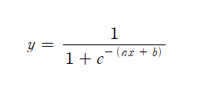
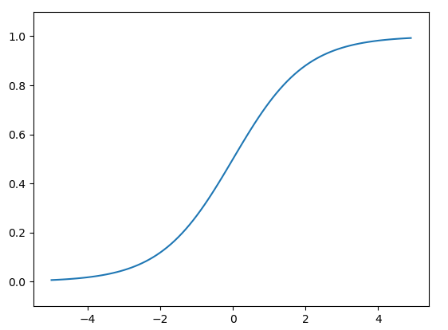
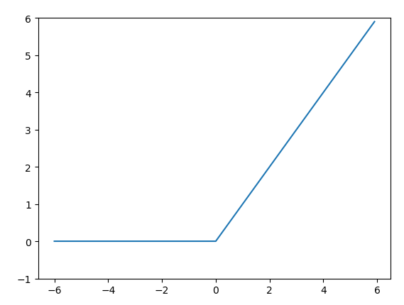
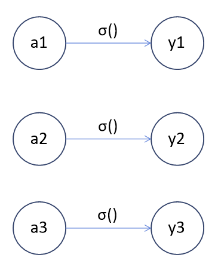

# neuralNetwork

## Neural Network

: 신경망은 각 층의 뉴런들이 다음 층의 뉴런으로 신호를 전달한다는 점에서 퍼셉트론이랑 같다 하지만 뉴런으로 갈 때 신호를 변화시키는 활성화 함수에 큰 차이점이 있다. 신견망에서는 매끄럽게 변화하는 시그모이드 함수를, 퍼셉트론에서는 갑자기 변화하는 계단 함수를 활성화 함수로 사용한다.

* 신경망과 퍼셉트론의 다른점은 퍼셉트론은 사람이 수동으로 가중치를 설정하는 작접 \(원하는 결과를 출력하도록 가중치 값을 적절히 정하는 작업\)을 한다. 하지만 신경망은 가중치 매개 변수의 적절한 값을 데이터로부터 자동으로 학습하는 능력이 있다 


* 신경망을 그림을 간단히 나타내면 다음과 같이 된다.
* 은닉층의 뉴런은 \(입력층이나 출력층과 달리\) 사람 눈에는 보이지 않는다.

## 활성화 함수의 등장

: 입력 신호의 총합을 출력 신호로 변환하는 함수를 일반적으로 활성화 함수\(activation function\)이라 한다

* 활성화라는 이름이 말해주듯 활성화 함수는 입력 신호의 종합이 활성호를 일으키는지를 정하는 역할을 역할을 한다
* 가중치가 곱해진 입력 신호의 총합을 계산하고, 그 합을 활성화 함수에 입력해 결과를 내는 단계로 처리
* 그래서 a = b + w1x1 + w2x2, y = h\(a\)라는 가중치가 달린 입력 신호와 편향의 총합을 계산하고 이를 a라 한다 
* 그리고 a를 함수 h\(\)에 넣어 y를 출력하는 흐름이다 

  ![activationFunction\]](../.gitbook/assets/activationFunction.png)   

* 활성화 함수의 처리를 보면, 가중치 신호를 조합한 결과가 a라는 노드가 되고, 활성화 함수 h\(\)를 통화하여 y라는 노드로 변환된다 

tip\) 일반적으로 단순 퍼셉트론은 단층 네트워크에서 계단 함수\(입계값을 경계로 출력이 바뀌는 함수\)를 활성화 함수로 사용한 모델을 가리키고, 다층 퍼셉트론은 신경망\(여러 층으로 구성되고 시그모이드 함수 등의 매끈한 활성화 함수를 사용하는 네트워크\)을 가리킨다

## 활성화 함수

* 퍼셉트론에서는 활성화 함수로 계단 함수를 이용하며, 신경망에서는 활성화 함수를 계단함수에서 다른 함수로 변경하는 것이다 

## 계단 함수

* 입력이 0을 넘으면 1을 출력하고, 그외의 0을 출력하는 함수

```python
import numpy as np
def step_function(x):
    y = x > 0
    return y.astype(np.int)
```

```python
import numpy as np
import matplotlib.pylab as plt

def step_function(x):
    return np.array(x > 0, dtype = np.int)

x = np.arange(-5.0, 5.0, 0.1)
y = step_function(x)
plt.plot(x, y)
plt.ylim(-0.1, 1.1) 
plt.show()
```


* step\_function\(\)은 인수로 받은 넘파이 배열의 원소 각각을 인수로 계단 함수 실행해, 그 결과를 다시 배열로 만들어 준다 
* 계단 함수는 0을 경계로 출력이 0에서 1\(또는 1에서 0\)로 바뀐다. 

## 시그모이드 함수



* 신경망에서는 활성화 함수로 시그모이드 함수를 이용하여 신호를 변환하고, 그 변환된 신호를 다음 뉴런에 전달한다 
* 시그모이드\(sigmoid\) =  s자 모양

```python
import numpy as np
import matplotlib.pylab as plt

def sigmoid(x):
    return 1  / (1 + np.exp(-x))

x = np.arange(-5.0, 5.0, 0.1)
y = sigmoid(x)
plt.plot(x, y)
plt.ylim(-0.1, 1.1) 
plt.show()
```



## 시그모이드 함수와 계단 함수 비교

* 매끄러움의 차이, 시그모이드 함수는 부드러운 곡석이며,입력에 따라 출력이 연속적으로 변화한다. 한편 계단 함수는 0을 경계로 출력이 갑자기 바뀐다. 
* 시그모이드 함수의 이 매끈함이 신견망 학습에서 아주 중요한 역할을 한다 
* 둘다 입력이 작을 때의 출력은 0에 가깝고, 입력이 커지면 출력이 1에 가까워지는 구조인것이 공통점이다.  
* 또한 중요한 공통점은 둘다 비선형 함수이다. 시그모이드 함수는 곡선, 계단 함수는 계단처럼 구부러진 직선으로 나타난다 
* 비선형 함수 : 문자 그대로 선형이 아닌 함수로, 직선 1개로는 그릴 수 없는 함수 
* 신견망에서 비선형 함수로 사용해야 하는 이유? 
* 선형 함수의 문제는 층을 아무리 깊게 해도 은닉층이 없는 네트워크로도 똑같은 기능을 할 수 있다는데 있다. 즉, 선형 함수는 이용해서는 여러 층으로 구성하는 이점을 살릴 수 없다. 

## ReLU 함수

: 입력이 0을 넘으면 그 입력을 그래도 출력하고, 0이하면 0을 출력하는 함수

* 최근에는 시그모이드 함수에서 ReLU\(REctified Linear Unit, 렐루\)를 주로 이용한다 

```python
import numpy as np
import matplotlib.pylab as plt

def relu(x):
    return np.maximum(0, x)

x = np.arange(-6.0, 6.0, 0.1)
y = relu(x)
plt.plot(x, y)
plt.ylim(-1, 6) 
plt.show()
```



* 여기에서는 넘파이의 maximum 함수를 사용, maximum은 두 입력 중 큰 값을 선택해 반환하는 함수

## 신경망에서의 행렬 곱

: 다치원 배열의 스칼라곱을 구해주는 np.dot 함수를 사용하면 결과를 구할수 있다.    


```python
import numpy as np

x = np.array([1, 2])
w = np.array([[1, 3, 5], [2, 4, 6]])
y = np.dot(x, w)

print(y) # [ 5 11 17]
```

## 출력층 설계

: 신경망에서는 분류와 회귀 모두에 이용을 할 수 있다. 다만 둘 중 어떤 문제냐에 따라 출력층에서 사용하는 활성화 함수가 달다진다. 일반적으로 회귀에는 항등 함수를, 분류에는 소프트맥스 함수를 사용한다.

tip\) 기계학습 문제는 분류\(classification\)와 회귀\(regression\)로 나뉩니다. 분류는 데이터가 어느 클래스에 속하느냐는 문제입니다. 사진 속 인물의 성별을 분류하는 문제가 여기에 속한다. 한편 회귀는 입력 데이터에서 \(연속적인\) 수치를 예측하는 문제이다. 사진 속 인물의 몸무게를 예츠가는 문제가 회귀이다.

## 항등 함수\(identity function\)

: 입력과 출력이 항상 같다는 뜻이며 입력을 그대로 출력한다. 그래서 출력층에서 항등 함수를 사용하면 입력 신호가 드래고 출력 신호가 된다    


## 소프트맥스 함수 \(softmax function\)

:    


* exp는 지수 함수이며, n은 출력층의 뉴런수 yk는 그중 k번째 출력임을 뜻 

     

```python
def softmax(a):
    exp_a = np.exp(a) # 지수 함수
    sum_exp_a = np.sum(exp_a) # 지수 함수의 합
    y = exp_a / sum_exp_a

    return y
```

* 소프트맥스 함수 구현시 주의점 

  : 소프트맥스를 컴퓨터로 계산할 때의 결함은 오버플로 문제이다 

  소프트맥스 함수는 지수 함수를 사용하은데, 지수함수란 것이 쉽게 아주 큰값을 내뱉는다. 

  이런 큰 값끼리 나눗셈을 하면 결과 수치가 불안정해진다 

  * 오버플로\(overflow\) : 컴퓨터는 수를 4바이트나 8바이트와 같이 크기가 유한한 데이터로 다룬다, 다시 말해 표현할 수 있는 수의 범위가 한정되어 너무 큰 값을 표현할 수 없다는 문제가 발생한다 

       

  * 소프트맥스의 지수 함수를 계산할 때 어떤 정수를 더해도 \(혹은 빼도\) 결과는 바뀌지 않는다는 것이다 
  * 오버플로를 막을 목적으로는 입력 신호 중 최댓값을 이용하는 것이 일반적이다 

```python
def softmax(a):
    c = np.max(a)
    exp_a = np.exp(a - c) # 오버플로 대책
    sum_exp_a = np.sum(exp_a) 
    y = exp_a / sum_exp_a

    return y
```

## 소프트 맥스의 특징

* 소프트맥스 함수의 풀력은 0에서 1.0사이의 실수이다.
* 소프트맥스 함수 출력의 총합은 1이다. 이 성질 덕분에 소프트 맥스 함수의 확률로 해석할 수 있다 

  즉, 소프트맥스 함수를 이용함으로써 문제를 확률적\(통계적\)으로 대응할 수 있도록 만든다 

* 신경망을 이용한 분류에서는 일반적으로 가장 큰 출력을 내는 뉴런에 해당하는 클래스로만 인식한다.

  그리고 소프트맥스 함수를 적용해도 출력이 가장 큰 뉴런의 위치는 달라지지 않는다. 결과적으로 신경망으로 분류할 때는 출력층의 소프트맥스 함수를 생략해도 된다 

Tip\) 기계학습의 문제 풀이는 학습과 추론\(inference\)의 두 단계를 거쳐 이루어진다. 학습 단계에서 모델을 학습하고\(직업 훈련을 받고\), 추론 단계에서 앞서 학습한 모델로 미지의 데이터에 대해서 추론\(분류\)를 수행한다. 추론단계에서는 출력층의 소프트맥스 함수를 생략하는 것이 일반적이다. 한편 신경망을 학습시킬때는 출력층에서 소프트맥스 함수를 사용한다

## 출력층의 뉴런 수 정하기

* 출력층의 뉴런 수는 풀려는 문제에 맞게 적절히 정해야 한다. 분류에서는 분류하고 싶은 클래스 수로 설정하는 것이 일반적이다 

