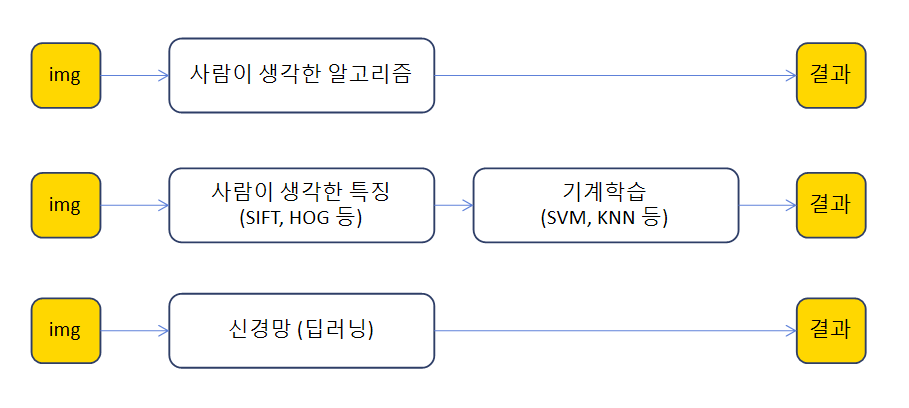
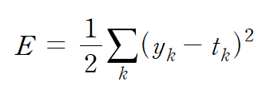
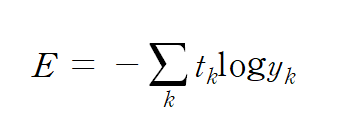
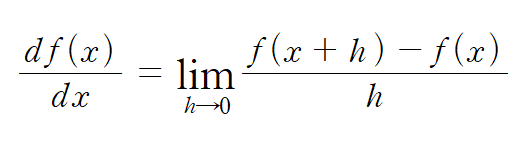
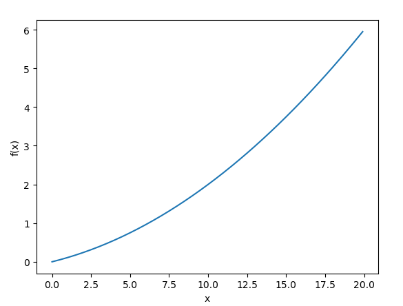
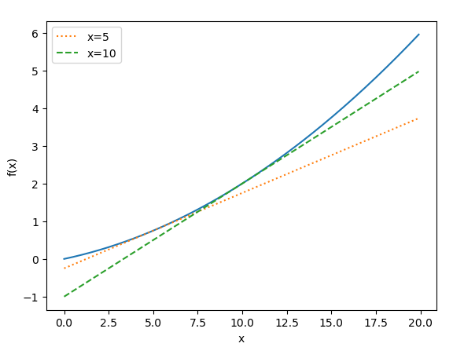
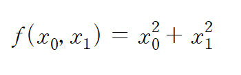
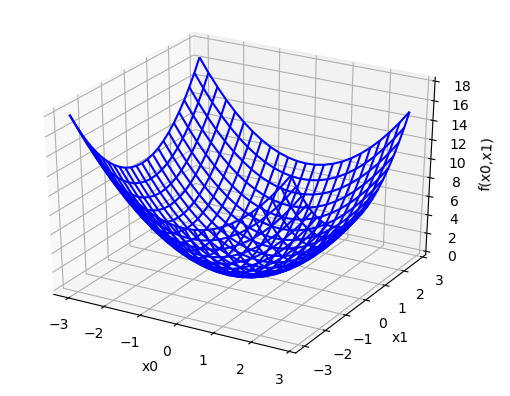
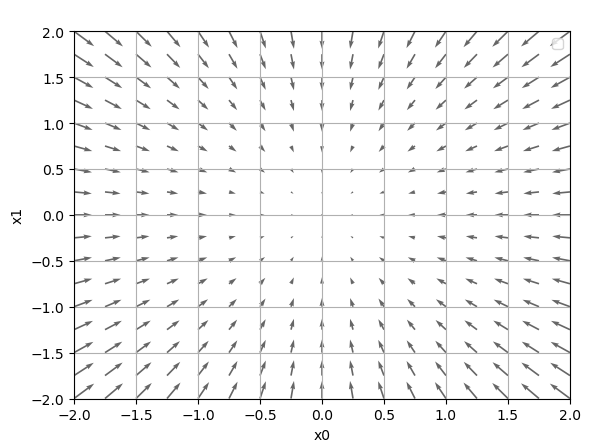
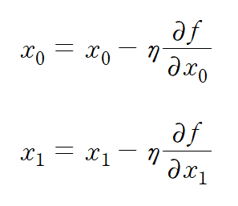

# neuralNetworkLearning

## Neural Network Learning

: 신경망 학습에서 학습이란 훈련 데이터로부터 가중치 매개변수의 최적값을 자동으로 획득하는 것

## 데이터 주도 학습

: 기계학습은 데이터에서 답을 찾고 데이터에서 패턴을 발견하고 데이터로 이야기를 만드는 것이다

* 기계학습의 방법 \(이미지의 예\)

    

* 첫번째 방법은 사람이 생각하는 알고리즘으로 사람마다 버릇이 달라 특정 짓는 규칙을 찾기도 쉽지 안혹 시간도 오래 걸린다 
* 두번째 방법은 이미지에서 특징\(feature\)을 추출하고 그 특징의 패턴을 기계학습 기술로 학습하는 방법

  이미지의 특징은 보통 벡터로 기술하고, 컴퓨터 비전 분야에서는 SIFT, SURF, HOG 등의 특징을 많이 사용한다.

  이런 특징을 사용하여 이미지 데이터 데이터로 변환하고, 변화된 벡터를 가지고 지도 학습 방식의 대표 분류 기법인 SBM, KNN 등으로 학습할 수 있다.

* 세번째 방법은 신견망은 이미지 있는 그래로 학습한다. 두번째 접근 방식에서는 특징을 사람이 설계했지만 신경망은 이미지에 포함된 중요한 특징까지도 기계가 스스로 학습할 것이다. 그래서 딥러닝을 종단간 기계학습 \(end-to-end machine learning\)이라고도 한다. 여기서 종단간이라 처음부터 끝까지라는 의미로 데이터\(입력\)에서 목표한 결과\(출력\)를 사람의 개입 없이 얻는 다는 뜻을 담고 있다 

## 훈련데이터와 시험데이터

: 기계 학습 문제는 데이터를 훈련데이터와 시험 데이터로 나눠 학습과 수행하는 것이 일반적이다

* 훈련데이터\(training data\) : 훈련데이터만 사용하면서 최적의 매개변수를 찾는다
* 시험데이터\(test data\) : 시험 데이터를 사용하여 앞서 훈련한 모델의 실력을 평가한다 

  왜? 훈련 데이터와 시험 데이터를 나눠야 할까?

* 우리가 원하는 것을 범용적\(아직 보지 못한 데이터\(훈련데이터에 포함되지 않는 데이터\)로도 문제를 올바르게 풀어내는 능력\)으로 사용할수 있는 모델이기 때문이다. 범용 능력을 제대로 평가하기 위해서 훈련데이터와 시험데이터를 분리하는 것이다.
* 데이터셋 하나로만 매개변수의 학습과 평가를 수행하면 올바른 평가가 될 수 없습니다. 수중의 데이터셋은 제대로 맞히더라도 다른 데이터셋에는 엉망인 일도 벌어집니다. 이렇게 하나의 데이터셋에만 지나치게 최적화된 상태를 오버피팅\(overfitting\)이라고 하며, 오버피팅을 피하는 것이 기계학습의 중요한 과제이기도 한다.

## 손실함수 \(loss function\)

: 신경망은 하나의 지표를 기준으로 최적의 매개변수 값을 탐색한다. 이때 사용하는 지표는 손실함수이다. 이 손실함수는 임의의 함수를 사용할 수도 있지만 일반적으로 평균 제곱 오차와 교차 엔트로피 오차를 사용한다 Tip\) 손실함수는 신경망 성능의 나쁨을 나타내는 지표로, 현재의 신견망이 훈련데이터를 얼마나 잘 처리하지 못하냐를 나타낸다. 하지만 손실함수에 마니어스만 곱하면 얼마나 좋으냐라는 지표로 변하기 때문에, 나쁨과 좋음 중 어느쪽으로 지표로 삼아도 본직적으로 수행하는 일을 다르지 않다

## 평균 제곱 오차 \(Mean Squared Error, MSE\)



* yk : 신경망의 출력 \(신경망이 추정한 값\)
* tk : 정답 레이블 
* k : 데이터의 차원수

```python
import numpy as np

def mean_squared_error(y , t):
    return 0.5 * np.sum((y-t)**2)
# t : 정답 레이블
# y : 신경망이 추정한 값
t = [0, 0, 1, 0, 0, 0, 0, 0, 0, 0] # 원-핫 인코딩, 정답 2
y1 = [0.1, 0.05, 0.6, 0.0, 0.05, 0.1, 0.0, 0.1, 0.0, 0.0] # '2'일 확률이 높다고 추정
y2 = [0.1, 0.05, 0.1, 0.0, 0.05, 0.1, 0.0, 0.6, 0.0, 0.0] # '7'일 확률이 높다고 추정

a1 = mean_squared_error(np.array(y1), np.array(t))
a2 = mean_squared_error(np.array(y2), np.array(t))
print(a1) # 0.09750000000000003
print(a2) # 0.5975
```

* 다음과 같이 정답 2이고 출력을 2일때와 7일때를 비교하였고, 각각을 출력하였다. 이실험의 결과로 2인 결과는 손실함수 쪽 출력이 작으며 정답 레이블과의 오차도 작은 것으로 알 수 있으며, 7인 결과는 신경망 출력은 높은 결과가 나왔다. 즉, 평균 제곱 오차를 기준으로는 오차가 더작은 첫번째 결과가 결과에 더  가까운 것으로 판단할 수 있다. 
* 원-핫 인코딩 : 한 원소만 1로 하고 그외는 0으로 나타내는 표기법 

## 교차 엔트로피 오차 \(cross entropy error: CEE\)

: 손실함수로서 평균제곱 오차와 같이 자주 사용한다



* 다음과 같이 yk는 신경망의 출력, tk는 정답 레이블이며, tk는 원-핫 인코딩을 사용하여 인덱스의 원소만 1이고 나머지는 0이다

  예를 들어 정답 레이블은 2가 정답이라 하고 이때의 신경망 출력이 0.6 이라면 교차 엔트로피 오차는 -log0.6 = 0.51 이 된다 

  또한, 같은 조건에서 신경망 출력이 0.1 이라고 하면 -log0.1 = 2.30 이 된다. 즉 교차 엔트로피 오차는 정답일 때의 출력이 전체 값을 정하게 된다 

```python
import numpy as np

def cross_entropy_error(y , t):
    delta = 1e-7 
    return -np.sum(t*np.log(y + delta))

t = [0, 0, 1, 0, 0, 0, 0, 0, 0, 0] # 원-핫 인코딩, 정답 2
y1 = [0.1, 0.05, 0.6, 0.0, 0.05, 0.1, 0.0, 0.1, 0.0, 0.0] # '2'일 확률이 높다고 추정
y2 = [0.1, 0.05, 0.1, 0.0, 0.05, 0.1, 0.0, 0.6, 0.0, 0.0] # '7'일 확률이 높다고 추정

a1 = cross_entropy_error(np.array(y1), np.array(t))
a2 = cross_entropy_error(np.array(y2), np.array(t))
print(a1) # 0.510825457099338
print(a2) # 2.302584092994546
```

## 미니배치 학습

: 훈련데이터에 대한 손실 함수의 값을 구하고, 그 값을 최대한 줄여주는 매개변수를 찾아낸다. 이렇게 하려면 모든 훈련데이터를 대상으로 손실 함수을 구하애 한다 즉, 훈련 데이터가 100개 있으면 그로부터 계산한 100개의 손실함수 값들의 합을 지표로 삼는 것이다. 그런데 훈련데이터가 수만개 데이터를 대상으로 손실합을 구하면 시간 등 문제가 발생한다. 이러 경우 데이터 일부를 추려 전체의 근사치를 이용할 수 있으며, 신명망 학습에서도 훈련 데이터로부터 일부만 골라 학습 수행하는 미니 배치\(mini-batch\)가 있다.

```python
np.random.choice(60000, 10) #지정한 범위 수 중에서 무작위로 원하는 개수만 꺼낼 수 있다
```

## \(배치용\) 교차 엔트로피 오차 구현하기

* 원-핫 인코딩일때 교차 엔트로피 오차 

```python
def cross_entropy_error(y , t):
    if y.ndim == 1:
        t = t.reshape(1, t.size)
        y = y.reshape(1, y.size)

    batch_size = y.shape[0]
    return -np.sum(t*np.log(y + 1e-7 )) / batch_size
```

: y가 1차원이라면, 즉 데이터 하나당 교차 엔트로피 오차를 구하는 경우는 reshape 함수로 데이터의 형상을 바꿔준다. 그리고 배치의 크기로 나눠 정규화하고 이미지 1장당 평균의 교차 엔트로피 오차를 계산한다

* 정답 레이블이 원-핫 인코딩이 아니라 2나 7 등의 숫자 레이블로 주어졌을 때 교차 엔트로피오차

```python
def cross_entropy_error(y , t):
    if y.ndim == 1:
        t = t.reshape(1, t.size)
        y = y.reshape(1, y.size)

    batch_size = y.shape[0]
    return -np.sum(np.log(y[np.arange(batch_size), t] + 1e-7 )) / batch_size
```

: 이 구현에서는 원-핫 인코딩일 때 t가 0인 원소는 교차 엔트로피 오차도 0이므로, 그 계산은 무시해도 좋다는 것이 핵심 다시 말하면 정답에 해당하는 신경망의 출려만으로 교차 엔트로피 오차를 계산할 수 있다.

* np.log\(y\[np.arange\(batch\_size\), t\]에서 np.arange\(batch\_size\)은 0부터 batch\_size-1까지 배열\(ex\) \[0, 1, 2, 3, 4\]\)을 생성하고, t에는 레이블\(ex\) \[2, 4, 6, 8, 1\]\)이 각각 저정되어 있으므로, np.log\(y\[np.arange\(batch\_size\), t\]는 각 데이터 정답 레이블에 해당하는 신경망을 출력한다. \(ex\) y\[0, 2\], y\[1, 4\], y\[2, 6\], y\[3, 8\], y\[4, 1\]\)

## 왜? 손실 함수를 설정하는가?

: 신경망 학습에서는 최적의 매개변수\(가중치와 편향\)를 탐색할 때 손실 함수의 값을 가능한 한 작게 하는 매개변수 값을 찾습니다. 이떄 매개변수의 미분\(정확히는 기울기\)을 계산하고, 그 미분 값을 단서로 매개변수의 값을 서서히 갱신하는 과정을 반복한다.   
 이때 그 가중치 매개변수이 손실 함수의 미분이란 '가중치 매개변수의 값이 아주 조금 변화시켰을 때, 손실함수가 어떻게 변하냐'라는 의미이다

* 신경망을 학습 할 때 정확도를 지표로 삼아서는 안된다. 정확도를 지표로 하면 매개변수의 미분이 대부분의 장소에서 0이 되기 때문이다   


  정확도를 지표로 삼으면 매개변수의 미분이 대부분 장소에서 0이 되는 이유는 정확도는 매개변수를 야간만 조정해서는 정확도가 개선되지 않고 일정하게 유지된다. 하지만 손실함수의 매개변수의 값이 조금 변하면 그에 반응하여 손실함수의 값도 변한다.  


  이는 계단함수를 활성화 함수를 사용하지 않는 이유가 동일하게 매개 변수의 작은 변화가 주는 파장을 계단 함수가 말살하여 손실함수의 값에는 아무런 변화가 나타나지 않게 되기 때문이다.

## 수치 미분

: 미분이란 한순간의 변화량을 표시한 것으로 경사법에서는 기울기\(경사\) 값을 기준으로 나아갈 방향을 정하며, 수치 미분이란 아주 작은 차분으로 미분하는 것을 말한다

* 간단히 말해 해석적 미분은 우리가 수학시간에 배운 그 미분이고, 수치 미분은 이를 근사치로 계산하는 방법이다
* 미분  
* 위의 공식을 이용하여 코드를 구현하면 두개의 문제점이 발생한다 
* 반올림 오차\(rounding error, 소수점 8자리 이하는 생략\)의 문제가 발생하며 1e-50을 float32형\(32비트 부동소수점\)으로 나타내면 0.0이 된다 

  그래서 1e-4정도의 값을 사용하면 좋은 결과를 얻는다고 알려져 있다

* 두번째 개선은 함수f의 차분과 관련된것이다. 근사로 구한 접선과 진정한 접선에는 오차가 발생하기 때문에, 이 오차를 줄이기 위해서 \(x + h\)와 \(x - h\)일 때의 함수 f의 차분을 계산하는 방법을 쓴다. 이 차분은 x를 중심으로 그 전후의 차분을 계산한다는 의미에서 중심차분 혹은 중앙 차분이라 한다 

```python
def numerical_diff(f, x):
    h = 1e-4
    return (f(x+h) - f(x-h)) /(2*h)
```

## 수치 미분의 예


```python
import numpy as np
import matplotlib.pylab as plt

def function_1(x):
    return 0.01*x**2 + 0.1*x

def numerical_diff(f, x):
    h = 1e-4
    return (f(x+h) - f(x-h)) /(2*h)

def tangent_line(f, x):
    d = numerical_diff(f, x)
    print(d)
    y = f(x) - d*x
    return lambda t: d*t + y

x = np.arange(0.0, 20.0, 0.1)
y1 = function_1(x)
tf1 = tangent_line(function_1, 5)
y2 = tf1(x)
tf2 = tangent_line(function_1, 10)
y3 = tf2(x)

plt.xlabel("x")
plt.ylabel("f(x)")
plt.plot(x, y1)
plt.plot(x, y2, linestyle=":", label = "x=5") 
plt.plot(x, y3, linestyle="--", label = "x=10")
plt.legend() 
plt.show()
```



* 다음은 식에 의한 그래프를 표현

    

* x=5, x=10에서의 접선 : 직선의 기울기는 수치미분에서 구한 값을 사용
* 각각의 값은 x=5일때는 0.1999999999990898, x=10일때는 0.2999999999986347의 수치 미분 값을 구하였다

## 편미분

: 다변수 함수의 특정 변수를 제외한 나머지 변수를 상수로 생각하여 미분



```python
import numpy as np
from mpl_toolkits.mplot3d import Axes3D
import matplotlib.pyplot as plt


def f(x0,x1): 
    return x0**2 + x1**2


# f(x,y) = x^2 + y^2 함수의 그래프 그리기 
fig = plt.figure() 
ax = fig.gca(projection='3d') 
x0 = np.arange(-3, 3, 0.25) 
x1 = np.arange(-3, 3, 0.25) 
x0, x1 = np.meshgrid(x0, x1) 
f= f(x0,x1) 

surf = ax.plot_wireframe(x0, x1, f, color='blue')
plt.xlabel('x0') 
plt.ylabel('x1') 
ax.set_zlabel('f(x0,x1)')
plt.show()
```



* 위의 공식에 따라 그래프를 구현하였다
* 분 x0=3, x1=4 일때, x0의 편미분과 x1의 편미분

```python
import numpy as np

def function_x0(x0):
    return x0*x0 + 4.0**2.0
 # 주의) x0*x0를 사용해야 하며, 2*x0은 다른 결과값이 나온다 

def function_x1(x1):
    return 3.0**2.0 + x1*x1

def numerical_diff(f, x):
    h = 1e-4
    return (f(x+h) - f(x-h)) /(2*h)

x0 = numerical_diff(function_x0, 3.0)
x1 = numerical_diff(function_x1, 4.0)
print("x0에 대한 편미분", x0) # 6.00000000000378
print("x1에 대한 편미분", x1) # 7.999999999999119
```

## 기울기

: 모든 변수의 편미분을 벡터로 정리한 것을 기울기 \(gradient\)라고 한다

```python
import numpy as np
import matplotlib.pylab as plt
from mpl_toolkits.mplot3d import Axes3D

def _numerical_gradient_no_batch(f, x):
    h = 1e-4 # 0.0001
    grad = np.zeros_like(x) # x와 형상이 같은 배열을 생성
        for idx in range(x.size):
        tmp_val = x[idx]
        # f(x+h) 계산
        x[idx] = float(tmp_val) + h
        fxh1 = f(x)
        # f(x-h) 계산
        x[idx] = tmp_val - h 
        fxh2 = f(x) 

        grad[idx] = (fxh1 - fxh2) / (2*h)
        x[idx] = tmp_val # 값 복원
    return grad

def numerical_gradient(f, X):
    if X.ndim == 1:
        return _numerical_gradient_no_batch(f, X)
    else:
        grad = np.zeros_like(X)

        for idx, x in enumerate(X):
            grad[idx] = _numerical_gradient_no_batch(f, x)

        return grad


def function_2(x):
    if x.ndim == 1:
        return np.sum(x**2)
    else:
        return np.sum(x**2, axis=1)


def tangent_line(f, x):
    d = numerical_gradient(f, x)
    print(d)
    y = f(x) - d*x
    return lambda t: d*t + y

if __name__ == '__main__':
    x0 = np.arange(-2, 2.5, 0.25)
    x1 = np.arange(-2, 2.5, 0.25)
    X, Y = np.meshgrid(x0, x1)

    X = X.flatten()
    Y = Y.flatten()

    grad = numerical_gradient(function_2, np.array([X, Y]) )

    plt.figure()
    plt.quiver(X, Y, -grad[0], -grad[1],  angles="xy",color="#666666"))
    plt.xlim([-2, 2])
    plt.ylim([-2, 2])
    plt.xlabel('x0')
    plt.ylabel('x1')
    plt.grid()
    plt.legend()
    plt.draw()
    plt.show()
```



* 기울기는 방향을 가진 벡터\(화살표\)로 그려진다. 기울기는 함수의 가장 낮은 장소\(최솟값\)에서 멀어질수록 화살표의 크기가 커짐을 알수 있다 
* 하지만 기울기는 각 지점에서 낮아지는 방향을 가리킨다
* 더 정확히 말하자면 기울기가 가리키는 쪽은 각 장소에서 함수의 출력 값을 가장 크게 줄이는 방향이다.\(중요\)

## 경사 하강법\(경사법, gradient descent\)

: 신경망은 최적의 매개변수\(가중치와 편향\)를 학습 시에 찾아야 한다. 여기에서 최적이란 손실 함수가 최솟값이 될 때의 매개변수 값이다.

* 기울기를 잘 이용해 함수의 최솟값\(또는 가능한 작은 값\)을 찾으려는 것이 경사 하강법\(경사법\)이다
* 기울기진 방향이 꼭 최솟값은 아니며, 기울기 정보를 단서로 나아갈 방향을 정해야 한다 
* 경사법은 현 위치에서 기울어진 방향으로 일정 거리만큼 이동한 후을 반복하면서 기울기를 구한다. 이렇게 해서 함수의 값이 점차 줄이는 것을 경사법이다 

tip\) 함수가 극솟값, 최솟값, 또는 안정점\(saddle point\)이 되는 장소에서는 기울기가 0이다. 이때 안정점은 어느 방향에서 보면 극댓값이 되고 다른 방향에서 보면 극솟값이 되는 점이다. 경사법은 기울기가 0인 장소를 찾지만 그것이 반드시 최솟값이라고 할 수 없다.   
 또 복잡하고 찌그러진 모양의 함수라면\(대부분\) 평평한 곳으로 파고들면서 고원\(plateau, 플래토\)이라 하는, 학습이 진행되지 않는 정체기에 빠질 수 있다. tip\) 경사법은 최솟값과 최댓값에 따라 경사하강법, 경사상승법으로 나뉘며 부호만 반전이므로 본질적으로는 중요하지 않다



* 에타 기호는 갱신하는 양을 나타내며, 이를 신경망 학습에서는 학습률\(learning rate\)라고 한다. 
* 한번의 학습으로 얼마만큼 학습해야 할지, 즉 매개변수 값을 얼마나 갱신하느냐를 정하는 것이 학습률이다 

```python
def gradient_descent(f, init_x, lr=0.01, step_num = 100):
    x = init_x

    for i in range(step_num):
        grad - numerical_gradient(f,x)
        x -= lr * grad
    return x
```

tip\)학습률 같은 매개변수를 하이퍼파라미터\(hyper parameter, 초매개변수\)라고 한다. 이는 가중치와 편향 같은 신경망의 매개변수와는 성질이 다른 매개변수이다. 신경망의 가중치 매개변수는 훈련데이터와 학습 알고리즘에 의해서 자동으로 획득되는 매개변수인 반면, 학습률 같은 하이퍼파라미터는 사람이 직접 설정해야 하는 매개변수이다. 일반적으로 이들 하이퍼파라미터는 여러 후보 값 중에서 시험을 통해 가장 잘 학습하는 값을 찾는 과정을 거쳐야 한다

