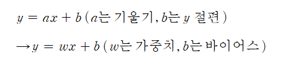

# perceptron

### perceptron

### Overview

퍼셉트론 \(perceptron\) : 퍼셉트론은 프랑크 로젠블라트\(_Frank Rosenblatt_\)가 1957년에 고안한 알고리즘이며, 다수의 신호를 입력으로 받아 활성화 함수와 함께 사용해 출력 값을 다음으로 넘기는 가장 작은 신경망 단위 신경망\(딥러닝\)의 기원이 되는 알고리즘 퍼셉트론의 구조를 배우는 것은 신경망과 딥러닝으로 나아가는 데 중요한 아이디어를 배운다.

* 신호란 ? 전류나 강물처럼 흐름이 있는 것. 즉, 1은 신호가 흐른다, 0을 신호가 흐르지 않는다  



* 입력값 \(x\)과 가중치\(w\)의 곲을 모두 더한 다음 거기에 바이어스\(b\)를 더한 값을 가중합\(y\)이라고 한다 가중합의 결과를 놓고 1 또는 0을 출력해서 다음으로 보내며, 0과 1을 판단하는 함수가 있는데 이를 활성화 함수 \(activation function\)이라 한다
* 단순한 논리 회로

  | 게이트\(gate, 회로\) | 정의 |
  | :--- | :--- |
  | AND 게이트 | 모두가 1일때만 |
  | NAND 게이트 | Not AND 의미 |
  | OR 게이트 | 신호중에 하나 이상이 1이면 |
  | XOR 게이트 | 둘 중 하나만 1일 때 1을 출력 |

### 퍼셉트론으로 구현하기 : AND, NAND, OR

* AND 함수 \(가중치와 편향을 도입\)

```python

import numpy as np


def AND(x1, x2):
    x = np.array([x1, x2])
    w = np.array([0.5, 0.5])
    b = -0.7
    tmp = np.sum(w*x) + b
    if tmp <= 0:
        return 0
    else:
        return 1

if __name__ == '__main__':
    for xs in [(0, 0), (1, 0), (0, 1), (1, 1)]:
        y = AND(xs[0], xs[1])
        print(str(xs) + " -> " + str(y))
        
# (0, 0) -> 0
# (1, 0) -> 0
# (0, 1) -> 0
# (1, 1) -> 1
```

- NAND 게이트
```python
import numpy as np

def NAND(x1, x2):
    x = np.array([x1, x2])
    w = np.array([-0.5, -0.5])
    b = 0.7
    tmp = np.sum(w*x) + b
    if tmp <= 0:
        return 0
    else:
        return 1
if __name__ == '__main__':
    for xs in [(0, 0), (1, 0), (0, 1), (1, 1)]:
        y = NAND(xs[0], xs[1])
        print(str(xs) + " -> " + str(y))
# (0, 0) -> 1
# (1, 0) -> 1
# (0, 1) -> 1
# (1, 1) -> 0
```

* OR 게이트 

```python
import numpy as np


def OR(x1, x2):
    x = np.array([x1, x2])
    w = np.array([0.5, 0.5])
    b = -0.2
    tmp = np.sum(w*x) + b
    if tmp <= 0:
        return 0
    else:
        return 1

if __name__ == '__main__':
    for xs in [(0, 0), (1, 0), (0, 1), (1, 1)]:
        y = OR(xs[0], xs[1])
        print(str(xs) + " -> " + str(y))
        
# (0, 0) -> 0
# (1, 0) -> 1
# (0, 1) -> 1
# (1, 1) -> 1
```

### 다층 퍼셉트론 
: 기존이 퍼셉트론으로는 XOR를 해결할 수 없어 다층 퍼셉트론으로 그 문제를 해결하였다.
즉, 좌표 평면 자체에 변화를 주어, 두개의 퍼셉트론을 한번에 계산가능하게 만들었으며,
숨어있는 층, 즉 은닉층을 만들어서 그 문제를 해결하였다 
은닉층에 모이는 중간 정거장을 노드(node)라고 한다

 <br>
- 위 두 식의 결과값이 출력츠응로 보내지며, 출력층에서는 시그모이드 함수를 통해 y값이 정ㅎ진다 
  이 값을 yout이라 할때 식으로 표현하면 

 <br>
- 각각의 가중치(w) 와 바이어스 (b)의 값을 2차원 배열로 늘어 놓을 수 있으며, 
  은닉층을 포함해 가중치 6개와 바이어스 3개가 필요하다 

### 코딩ㅇ으로 XOR 문제 해결 
```python
import numpy as np

# 가중치와 바이어스
w11 = np.array([-2, -2])
w12 = np.array([2, 2])
w2 = np.array([1, 1])
b1 = 3
b2 = -1
b3 = -1

# 퍼셉트론
def MLP(x, w, b):
    y = np.sum(w * x) + b
    if y <= 0:
        return 0
    else:
        return 1

# NAND 게이트
def NAND(x1,x2):
    return MLP(np.array([x1, x2]), w11, b1)

# OR 게이트
def OR(x1,x2):
    return MLP(np.array([x1, x2]), w12, b2)

# AND 게이트
def AND(x1,x2):
    return MLP(np.array([x1, x2]), w2, b3)

# XOR 게이트
def XOR(x1,x2):
    return AND(NAND(x1, x2),OR(x1,x2))
    # XOR를 만들어 주기 위해서는 위에서 정의한 AND, NAND, OR를 이용하여 
    # 숨어있는 두 개의 노드를 둔 다층의 퍼셉트론으로 XOR 문제를 해결한다  


# x1, x2 값을 번갈아 대입해 가며 최종값 출력
if __name__ == '__main__':
    for x in [(0, 0), (1, 0), (0, 1), (1, 1)]:
        y = XOR(x[0], x[1])
        print("입력 값: " + str(x) + " 출력 값: " + str(y))
```

```text
입력 값: (0, 0) 출력 값: 0
입력 값: (1, 0) 출력 값: 1
입력 값: (0, 1) 출력 값: 1
입력 값: (1, 1) 출력 값: 0
```

