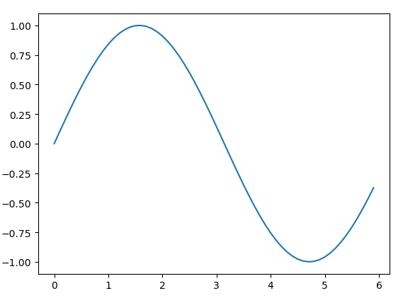
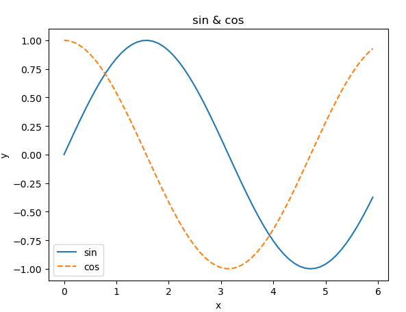

# matplotlib

## matplotlib

: 데이터를 차트\(chart\)나 플롯\(plot\)으로 시각화\(visulaization\)하는 패키지 데이터 분석에서 Matplotlib은 데이터 분석 이전에 데이터 이해를 위한 시각화나, 데이터 분석 후에 결과를 시각화하기 위해서 사용

```text
pip install matplotlib
```

## 단순한 그래프 그리기

: 그래프를 그리기 위해서는 matplotlib의 pyplot

```python
import numpy as np
import matplotlib.pyplot as plt
# 데이터 준비 
x = np.arange(0, 6, 0.1) # 0에서 6까지 0.1 간격으로 생성
y = np.sin(x)
# 그래프 
plt.plot(x, y)
plt.show()
```



## pyplot이 기능

: 제목과 각 축의 이름\(레이블\) 표시 등을 사용할 수 있다

```python
import numpy as np
import matplotlib.pyplot as plt
# 데이터 준비 
x = np.arange(0, 6, 0.1) # 0에서 6까지 0.1 간격으로 생성
y1 = np.sin(x)
y2 = np.cos(x)
# 그래프 
plt.plot(x, y1, label = "sin")
plt.plot(x, y2, linestyle="--", label = "cos") # cos는 점선으로 그리기
plt.xlabel("x")
plt.ylabel("y")
plt.title("sin & cos")
plt.legend()  #범례 삽입
plt.show()
```



## 이미지 표시하기

: pyplot에는 이미지를 표시해주는 메서드인 imshow\(\)도 있다. 이미지를 읽어 들일 때는 matplotlib.image모듈의 imread\(\)메서드를 이용

```python
import matplotlib.pyplot as plt
from matplotlib.image import imread

img = imread('xxx.png') # 이미지 읽어오기(적당한 경로를 설정해야 한다)

plt.imshow(img)
plt.show()
```

