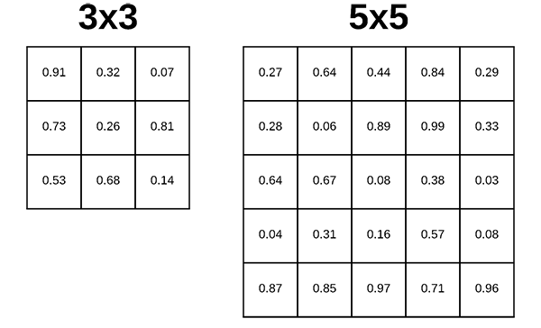
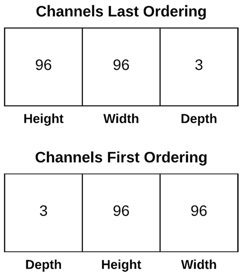

# Conv2D

## Conv2D

## tf.keras.layers.Conv2D

```python
tf.keras.layers.Conv2D(
    filters, 
    kernel_size, 
    strides=(1, 1), 
    padding='valid', 
    data_format=None,
    dilation_rate=(1, 1), 
    groups=1, 
    activation=None, 
    use_bias=True,
    kernel_initializer='glorot_uniform', 
    bias_initializer='zeros',
    kernel_regularizer=None,
    bias_regularizer=None, 
    activity_regularizer=None,
    kernel_constraint=None, 
    bias_constraint=None, **kwargs
)
```

### filters

* 컨볼 루션의 출력 필터 수

### kernel\_size

* 컨볼루션 커널의 \(행, 열\) 
* 연산을 수행할 때 윈도우의 크기를 의미



### padding

* ‘valid’ : 유효한 영역만 출력이 됩니다. 따라서 출력 이미지 사이즈는 입력 사이즈보다 작습니다.
* ‘same’ : 출력 이미지 사이즈가 입력 이미지 사이즈와 동일합니다.


### strides

* strides는 입력데이터에 필터를 적용할 때 이동할 간격을 조절하는 것, 즉 필터가 이동할 간격을 말한다
* strides의 디폴트 값은 \(1,1\)이다 

### data\_format

* channels\_last \(default\) 또는 channels\_first으로 구한다.
* channels last : \(batch\_size, height, width, channels\)
* channels\_first : \(batch\_size, channels, height, width\)



### dilation\_rate

* dilation 합성곱 사용시 적용할 dilation 값으로서 정수 혹은 정수의 리스트, 튜플 형태로 지정합니다.
* 1이 아닌 값을 지정하면 strides 값으로 1 이외의 값을 지정하지 못합니다.


### groups

* 채널 축을 따라 입력이 분할되는 그룹 수를 지정

### activation

* 활성화 함수를 지정하며, 디폴트는‘linear’ 
* ‘linear’ , ‘relu’ , sigmoid’ 등
* keras.activations 참조

### other

* use\_bias : 편향\(b\)을 사용할지 여부. Boolean 타입입니다.
* kernel\_initializer : 가중치\(W\) 초기화 함수
* bias\_initializer : 편향 초기화 함수
* kernel\_regularizer : 가중치 정규화 방법
* bias\_regularizer : 편향 정규화 방법
* activity\_regularizer : 출력값 정규화 방법
* kernel\_constraint : Optimizer에 의해 업데이트 된 이후에 가중치에 적용되는 부가적인 제약 함수
* bias\_constraint : Optimizer에 의해 업데이트 된 이후에 편향에 적용되는 부가적인 제약 함수

### input\_shape

```python
Conv2D(1, (2, 2), padding='valid', input_shape=(3, 3, 1))
```

* 샘플 수를 제외한 입력 형태를 정의 \(모델에서 첫 레이어일 때만 정의\)
* \(행, 열, 채널 수\)로 정의합니다. 흑백영상인 경우에는 채널이 1이고, 컬러\(RGB\)영상인 경우에는 채널을 3으로 설정

