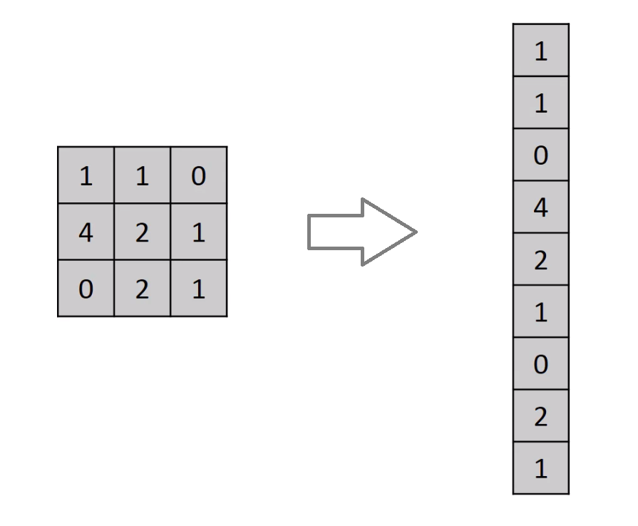

# Flatten

## Flatten

## tf.keras.layers.Flatten

### flatten의 정의

* Convolution layer나 Maxpooling layer는 주로 2차원 자료를 다루지만 전결합층에 전달하기 위해선 1차원 자료로 바꿔줘야 하며, 이를 위해서 flatten 을 이용



```python
Flatten()
```

