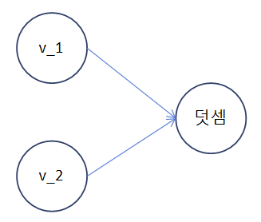

# tensorflow1x

## tensorflow \(version 1.x\)

## 텐서플로 1.x의 이해

```python
import tensorflow as tf

message = tf.constant('hello world')
with tf.session() as sess:
    print(sess.run(message).decode())
```

## 텐서플로 1.x 계산 그래프\(computational graph\) 구조

### 계산그래프

: 계산 그래프는 노드\(node\) 와 에지\(edge\)를 가진 네트워크이다. 여기에서 사용할 모든 데이터, 즉 텐서 객체\(상수, 변수, 플레이스홀더\(placeholder\)\)와 수앵할 모든 계산 즉연삭 객체가 정의 된다.

* 플레이스홀더\(placeholder\)는 단순히 나중에 데이터를 할당하귀 위한 변수. 이를 사용하면 데이터 없이도 계산 그래프를 생성할 수 있다 

  각 노드는 0개 이사의 입력을 가질 수 있지만 하나의 출력만 자질 수 있다. 네트워크의 노드는 객체\(텐서\(tensor\)와 연산\(operations\)\)를 나타내고 에지는 연산 간에 흐르는 텐서를 나타낸다. 계산 그래프는 신경망의 청사진을 정의하지만 그안의 텐서에는 아직 연계된 값이 없다.

#### 그래프의 실행

그래프의 실행은 텐서와 연산 객체가 평가되는 환경을 캡슐화하는 세션\(session\) 객체를 사용해 수행된다. 세션 객체는 한 계층에서 다른 게층으로 정보의 실제 계산과 전송이 이뤄지는 곳이다. 다른 텐서 객체의 값은 세션 객체에서만 초기화, 접근, 저장된다. 이 시점까지 텐서 객체는 추상적인 정의 불과

#### 그래프를 사용하는 이유

1. 그래프는 \(심층\) 신경망을 설명해 줄 수 있는 자연스러운 비유가 된다
2. 그래프는 공통 하위 표현식을 제거하고, 커널을 합치고, 중복 표현식을 제거해서 자동으로 최적화할 수 있다.
3. 그래프는 훈련 중에 쉽게 배포할 수 있으며, CPU,GPU,TPU 같은 다양한 환경과 클라우드, IOT, 모바일, 기존 서버 같은 다양한 환경에 배포할 수 있다.
4. 결국 함수형 프로그래밍에 익숙하다면 계산 그래프는 단순 프리미티브\(primitives: 초기의 \)의 합성이라는 일반적인 개념일 뿐이다. 

### 계산 그래프의 예제



```python
import tensorflow as tf

v_1 =  tf.constant([1, 2, 3, 4])
v_2 =  tf.constant([2, 1, 5, 3])

v_add = tf.add(v_1, V_2)

with tf.Session() as sess:
    print(sess.run(v_add)) # [3, 3, 8, 7]
# 다른 표현
# sess = tf.Session()
# print(sess.run(v_add))
# sess.close()
```

* 텐서플로를 사용하면 tf.device\(\)를 사용해 계산 그래프의 다른 객체와 함꼐 특정 장치\(CPU/GPU\)를 사용할 수 있다. 

```text
run(fetches, feed_dict=None, options=None, run_metadata)
```

* 이 명령은 fetches 매개변수에서 텐서를 계산한다. 예제에서는 fetches에 v\_add텐서가 있다. run 메서드는 v\_add로 이어지는 그래프 내의 모든 텐서와 연산을 실행한다. 
* fetches는 단일 텐서나 연산 객체 혹은 둘 이상일 수 있다. 예를 들면 fetches가 \[v\_1, V\_2, V\_add\]를 가진다면 출력은 \[array\(\[1, 2, 3, 4\]\), array\(\[2, 1, 5, 3\]\), array\(\[3, 3, 8, 7\]\)\] 이며, 동일한 프로그램 코드 내에서 다수의 세션 객체를 가질 수 있다. 

### 상수, 변수, 플레이스홀더와 작업

: 텐서플로는 간단히 말해 다양한 수학 연산을 텐서로 정의하고 수행하는 라이브러리를 제공하는것이며, 텐서는 기본적으로 n차원 배열이다. 모든 유형의 데이터, 즉 스칼라, 벡터, 행렬은 특수한 형태의 텐서이다.

| 데이터 형식 | 텐서 | 형태 |
| :--- | :--- | :--- |
| 스칼라 | 0차원 텐서 | \[\] |
| 벡터 | 1차원 텐서 | \[D0\] |
| 행렬 | 2차원 텐서 | \[D0, D1\] |
| 텐서 | n차원 텐서 | \[D0, D1, ... , Dn-1\] |

텐서플로는 3가지 유형의 텐서를 제공   
 1. 상수 : 상수는 텐서이며 값을 변경할 수 없다 2. 변수 : 세션 내에서 값을 갱신해야 할 떄 변수 텐서를 사용 3. 플레이스 홀더 : 텐서플로 그래프에 값을 넣을 때 사용된다. 보통 신경망을 훈련시키는 동안 새로운 훈련 예시를 제공하는 데 사용된다.

### 상수

* 스칼라 상수 

```python
t_1 = tf.constant(4)

t_2 = tf.constant([4, 3, 2])
```

* 모든 원소의 값이 0인 텐서 : zeros\(\)

```python
tf.zeros([M,N], tf.dtype)

tf.zeros([2,3], tf.int32) # [[0, 0, 0], [0, 0, 0]]
```

* 모든 원소의 값이 1인 텐서 : ones\(\)

```python
tf.ones([M,N], tf.dtype)

tf.ones([2,3], tf.int32) # [[1, 1, 1], [1, 1, 1]]
```

* 텐서의 형태 확인 : shape

```python
print(tf.zeros([2,3], tf.int32).shape) # (2, 3)
```

* 기본의 넘파이 배열 또는 텐서 상수와 동일한 형태의 텐서 변수

```python
tf.zeros_like(t_2)

tf.ones_like(t_2)
```

* 브로드캐스트 

```python
t = tf.Variable([[0., 1., 2.],[3., 4., 5.],[6., 7., 8.]])

print(t*2)
# tf.Tensor(
# [[ 0.  2.  4.]
#  [ 6.  8. 10.]
#  [12. 14. 16.]], shape=(3, 3), dtype=float32)
```

### 시퀀스 \(sequences\)

* start부터 end까지 균등하게 분포한 전체 num개의 시퀀스\(Sequences\)를 생성

```python
tf.linspace(start, stop, num) # 해당 값은 (stop-start)/(num-1)만큼 다르다 

tf.linspace(2.0, 5.0, 5) # tf.Tensor([2.   2.75 3.5  4.25 5.  ], shape=(5,), dtype=float32)
```

* Start\(기본설정 = 0\) 부터 limit\(limit는 포함하지 않음\) 까지 delta\(기본설정 = 1\)만큼 증가하면서 시퀀스 수를 생성

```python
tf.range(start, limit, delta)

tf.range(10) # tf.Tensor([0 1 2 3 4 5 6 7 8 9], shape=(10,), dtype=int32)
```

### 랜덤 텐서

* 평균이 mean\(기본설정 = 0.0\), 표준편차가 stddev\(기본설정 = 1.0\) 이며, 형태가 \[M, N\]인 정규 분포를 따르는 랜덤 값을 seed를 이용해 생성

```python
t_random = tf.random_normal([2, 3], mean = 2.0, stddev = 4, seed =12)
```

* 평균이 mean\(기본설정 = 0.0\), 표준편차가 stddev\(기본설정 = 1.0\) 이며, 형태가 \[M, N\]인 잘려진 정규 분포를 따르는 랜덤 값을 seed를 이용해 생성

```python
t_random = tf.truncated_normal([1, 5], stddev = 2, seed =12)
```

* seed를 사용해 \[minval \(기본설정 = 0\), maxval\] 범위에서  형태가 \[M, N\]인 감마 분포를 따르는 랜덤 변수
* 주어진 텐서를 특정 크기로 랜덤으로 절단

```python
t_random = tf.random_uniform([2, 3], maxval = 4, seed =12) # maxval 범위에서의 랜덤 변수
tf.random_crop(t_random, [2, 5], seed =12 ) # 특정 크기로 절단
```

* 훈련 표본을 랜덤 순서로 나타낼 필요가 있을 때마다 tf.random\_stuffle\(\)을 사용해 텐서를 램덤으로 첫번 째 차원 축을 따라 섞는다. t\_random이 섞고자 하는 텐서라면 다음고 같이 한다 

```python
tf.random_shuffle(t_random)
```

* 랜덤으로 생성한 텐서는 초기 시드\(seed\)에 영향을 받는다. 여러 번의 실행 또는 세션에서 동일한 난수를 얻으려면 시드가 상수로 설정돼야 한다. 사용 중인 랜덤 텐서의 수가 많을 경우 tf.set\_random\_seed\(\)를 사용해 모든 랜덤 생성 텐서에 시드를 설정할 수 있다

```python
tf.set_random_seed(54)
```

### 변수 : tf.variable

* 변수 초기화 : initializer

```python
tf.global_variables_initializer()
# ------------exam
bias = tf.Variable(tf.zeros([100,100]))
with tf.Session() as sess:
    sess.run(bias.initializer)
```

* 변수 저장 : saver

```python
saver = tf.train.saver()
```

* 플레이스홀더 

```python
tf.placeholder(dtype, shape=None, name=None)
#  dtype : placeholder 데이터 형식을 지정하며 플레이스 홀더를 선언하는 동안 지정해야 한다
```

```python
# 플레이스 홀더 예제 
# : x에 대한 플레이스 홀더를 정의하고 임의의 4x5행렬에 대해 feed_dict를 사용해  y=2x를 계산한다 
# feed_dict는 텐서플로 플레이스홀더에 값을 공급하는데 사용

x = tf.placeholder("float")
y = 2 * x
data = tf.random_uniform([4,5], 10)
with tf.Session() as sess:
    x_data = sess.run(data)
    print(sess.run(y, feed_dict = {x:x_data}))
```

