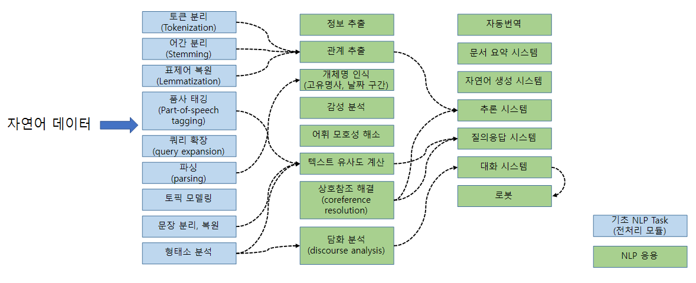

# overview

## Text Preprocessing

## 텍스트 전치리 \(Text Preprocessing\)

* 자연언어처리\(NLP\) 애플리케이션에 맞게 입력 데이터\(raw data\)를 변형하는 일련의 과정
* 전처리가 없이 원시 데이터를 사용할 경우 시스템의 품질 저하로 이어짐
* 시스템 개발 단계와 운영 단게에서 모두 입력 데이터 전처리 필요 
* 전처리 또한 NLP의 일부 과정 =&gt; 토큰 분리, 표제어 복원 등
* 자연어 텍스트를 벡터로 변환\(임베딩\)
* 머신러닝/딥러닝/데이터 마이닝 컨텍스트에서의 전처리 

## 자연언어처리

* 인공언어가 아닌 자연언어 데이터를 수집, 가공, 분석, 변환하는 소프트웨어 프로세싱

### 자연언어

* 한국어, 영어, 중국어와 같이 사람이 사용하는 언어
* 언어 공동체가 메세지 교환을 위해 자연적으로 발전시킨 기호 체계
* 규칙이 있으나 엄격하게 지키지 않아도 메시지 전달 가능
* 모호성\(중의성\)이 발생할 수 있다 
* 음성언어, 문자언어

### 형식 언어

* 특정 분야에서만 한정되어 사용되는 언어 
* 형식 문법 : 문자열 생성\(generation\)에 사용되는 심볼과 규칙에 집합
* 수학, 언어학, 컴퓨터 과학 분야에서 사용 ex\) 프로그래밍 언어, 수학식, 화학식
* 엄격한 분법 

### 자연언어 처리에 이해

* 언어를 통한 의미전달은 대화주체간 의식 속에 공유된 개념 \(shared concept\)이 있어야 가능하다 ex\) 살미아키\(외국의 사탕\)은 대한민국 국민에게는 생소하기 때문에 이해하기 어려울 수 있다
* 언어는 발전, 습득, 유지로 구성된 시스템이며, 커뮤니케이션의 복잡한 시스템의 사용이다.

## 자연언어처리의 주요 TASK

* 토큰처리부터 자동번역, 대화시스템까지 다양한 NLP Task 존재
* 전처리도 NLP Task에 속함
* NLP 애플리케이션에는 다양한 전처리 모듈들이 포함되어 있음.

